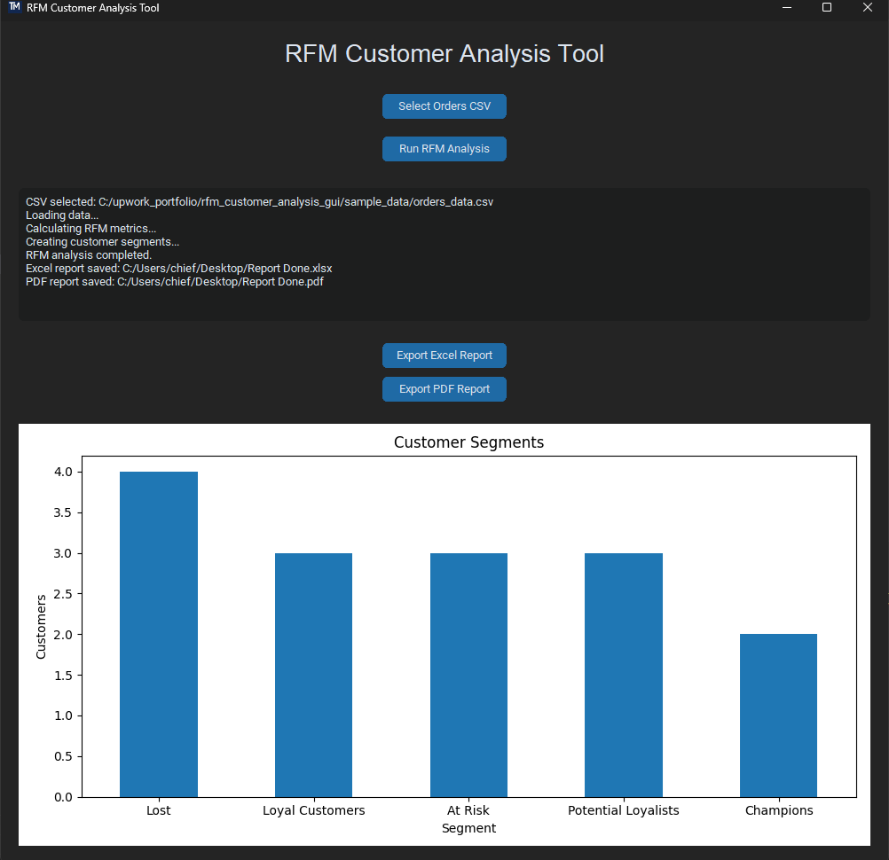

# RFM Customer Analysis Tool

Python desktop GUI application for customer segmentation using RFM (Recency, Frequency, Monetary) analysis.
## Quick Test (No Python Required)

Download the executable version:

➡ **Download EXE:** https://github.com/sergejs-dev/python-rfm_customer_analysis_gui/releases/latest

### Demo Dataset

A sample dataset is included:

sample_data/orders_data.csv

Use this file to quickly test the RFM analysis tool.

## Screenshot

## Features

• Load e-commerce orders CSV
• Calculate RFM metrics
• Automatic customer segmentation
• Interactive chart visualization
• Export Excel analytics report
• Export PDF report
• Clean GUI built with CustomTkinter

## Technologies

Python|
Pandas|
CustomTkinter|
Matplotlib|
ReportLab|
XlsxWriter

## Example Workflow

1. Select Orders CSV
2. Run RFM Analysis
3. View customer segments chart
4. Export Excel report
5. Export PDF report

## Example Use Cases

• E-commerce analytics  
• CRM customer segmentation  
• Marketing analytics  
• Shopify / Amazon sales analysis
